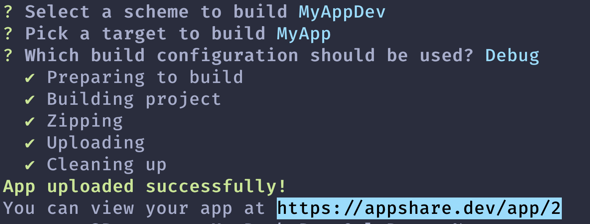

# appshare-cli

Upload your iOS app to Appshare with just a single command.

# Getting started

## Installation

Installing is as easy as running `npm install`.

```sh-session
$ npm install -g appshare
```

To verify the installation you can run.

```sh-session
$ appshare -v
appshare-cli/x.x.x ...
```

## Configure

The only configuration needed is signing up with your Appshare account. To sign in use the `appshare login` command. You will be prompted for an email and password.

```sh-session
$ appshare login

Welcome to appshare-cli.

Please sign in to your Appshare account using email and password.

Your email: [YOUR_APPSHARE_EMAIL]
Your password: [YOUR_APPSHARE_PASSWORD]
```

# Usage

## `appshare upload`

Upload your app to Appshare.

```sh-session
$ appshare upload
```

### Example

```sh-session
$ cd Desktop/MyApp
$ appshare upload
```

Your can also specify the path to your project's root directory with the `-p` or `--path` flag.

```sh-session
$ appshare upload --path Desktop/MyApp
```

### Configuring the build

`appshare upload` offers a very simple upload wizard that makes it super easy to configure your build.



# License

**appshare-cli** is available under the GNU Affero General Public License version 3. See the LICENSE file for more info.
